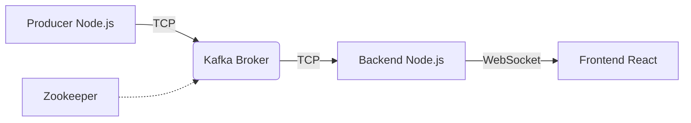

# 📡 TrackStream

Système de suivi de flotte en temps réel basé sur Apache Kafka, Docker et React.


TrackStream est une application démontrant une architecture orientée événements (Event-Driven) pour l'IoT. Elle simule, ingère, traite et visualise des données de positionnement GPS de véhicules à haute fréquence.

---

## 🏗️ Architecture

Le projet est entièrement conteneurisé et composé de services interconnectés via un réseau Docker privé :



* **Zookeeper** : Gestionnaire de configuration pour le cluster Kafka
* **Kafka Broker** : Système de messagerie distribué (Topic: `vehicle-tracking`)
* **Producer (Node.js)** : Simule des capteurs IoT pour 3 véhicules (V001, V002, V003)
* **Backend (Node.js/Express)** :

  * Consomme les messages Kafka
  * Calcule la vitesse moyenne glissante
  * Détecte les excès de vitesse (> 70 km/h)
  * Diffuse les données via Socket.IO
* **Frontend (React)** : Dashboard interactif avec carte, graphiques et alertes en temps réel

---

## 🚀 Fonctionnalités Clés

* 🗺️ **Géolocalisation Temps Réel** : Carte Leaflet avec marqueurs dynamiques
* 📊 **Analytique en direct** : Graphiques de vitesse (Chart.js) et calcul automatique de la vitesse moyenne
* 🚨 **Système d'Alertes** : Excès de vitesse détecté et notification instantanée
* 💾 **Historique de Trajet** : Visualisation des 10 dernières positions et vitesses par véhicule
* 🎨 **UI Intuitive** : Code couleur par véhicule (Rouge/Vert/Or)
* 🐳 **100% Dockerisé** : Déploiement en une seule commande

---

## 🛠️ Prérequis

* Docker et Docker Compose installés sur votre machine
* Aucun besoin de Node.js, Java ou Kafka localement

---

## 📦 Installation et Démarrage

Cloner le dépôt :

```bash
git clone https://github.com/votre-user/trackstream.git
cd trackstream
```

Lancer l'application :

```bash
docker-compose up --build
```

Ouvrir le dashboard :

```
http://localhost:3000
```

---

## 📂 Structure du Projet

```
trackstream/
├── docker-compose.yml
├── producer/
│   ├── vehicleProducer.js
│   └── Dockerfile
├── backend/
│   ├── server.js
│   ├── kafkaConsumer.js
│   └── Dockerfile
└── frontend/
    ├── public/
    ├── src/
    │   ├── App.js
    │   ├── MapView.js
    │   ├── SpeedChart.js
    │   └── socket.js
    └── Dockerfile
```

---

## 🔧 Commandes Utiles

Voir les logs en temps réel :

```bash
docker-compose logs -f
```

Arrêter l'application :

```bash
docker-compose down
```

Nettoyer les volumes Kafka si nécessaire :

```bash
docker-compose down -v
```

---

## 🐛 Dépannage Courant

* **Erreur : getaddrinfo ENOTFOUND kafka**
  Attendre quelques secondes, le backend se reconnectera automatiquement

* **La carte ne s'affiche pas**
  Vérifier la connexion internet (OpenStreetMap charge les tuiles en ligne)

---

## 🔮 Améliorations Futures

* Persistance longue durée avec MongoDB
* Authentification des utilisateurs
* Replay des trajets passés (Time-travel)
* Partitionnement du topic Kafka pour gérer des milliers de véhicules

---

## 📝 Auteur

Projet réalisé dans le cadre du module **Big Data & Architectures Distribuées**.
⭐ N'hésitez pas à laisser une étoile si ce projet vous a aidé !
